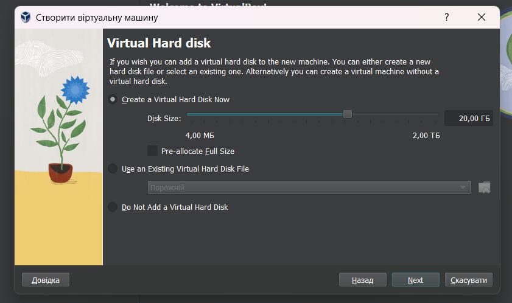
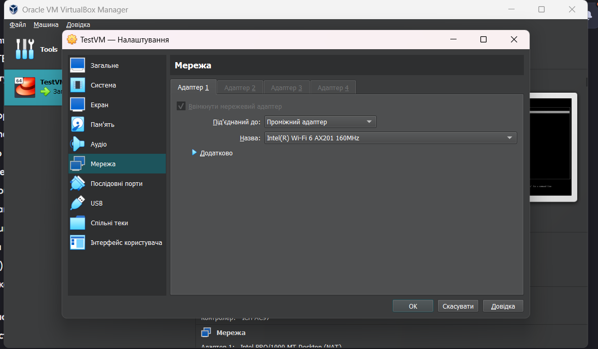

# lecture3

Оскільки Virtual Box в мене вже був встановлений, процес встановлення не зможу показати.
Відкриваємо Virtual Box

Натискаємо Створити 

Вводимо необхідні дані та обираємо iso image

Налаштовуємо параметри віртуальної машини

Додаємо проміжний адаптер

Далі процес втановлення операційної системи

запуск команди yum update

зловив таку хрінь (не вистачило ресурсів напевно)

додаю озу та процесори

Відкрийте налаштування VM, перейдіть до розділу Storage, виберіть диск і натисніть на кнопку Resize. Встановіть новий розмір диску (наприклад, 30 ГБ). 

щось не можу таке зробити

підключився по ssh для зручності 

встановлення nginx і його запуск

створення снапшоту 

запуск команди видалення

відновлення з снепшоту

після відновлення все працює

Налаштувати спільні папки між основною машиною і VM, щоб мати можливість обмінюватися файлами між ними.
Спершу маунтимо диск з гостьовими доповненнями

створюємо спільну папку

далі заходимо на віртуалку і маунтимо диск в систему
'''
sudo mount /dev/cdrom /mnt
'''
запускаємо встановлення гостьових доповнень
'''
sudo /mnt/VBoxLinuxAdditions.run
'''
маунтимо спільну папку
'''
sudo mount -t vboxsf -o rw,uid=1000,gid=1000 share ~/host
'''

